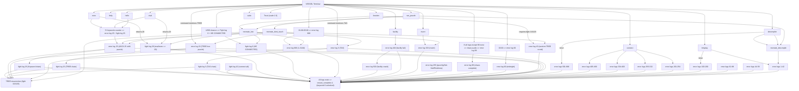

# Mermaid graph for progress

```mermaid
flowchart TD
    %% ROOT
    START["VESSEL Terminal"]

    %% CORE COMMANDS
    HELLO["hello"]
    HELP["help"]
    EXEC["exec"]
    EVAL["eval"]
    RUN["run_puzzle"]
    CONNECT["connect"]
    LOCATION["location"]
    FACILITY["facility"]
    INVERT["invert"]
    LETSPLAY["letsplay"]
    SUDO["sudo"]
    DECOMPILER["decompiler"]

    %% PUZZLE GENERATORS
    DECOMPILE_PZ["recreate_decompile"]
    DONTTOUCH_PZ["recreate_dont_touch"]
    LOST_PZ["recreate_lost"]

    %% TIME-BASED
    TIME_MIDNIGHT["00:00 => error log 60"]
    TIME_1_5["01:00-05:00 => error log 666"]

    %% SPECIAL META CONDITIONS
    TRUST["Trust (scale 1-5)"]
    CHANCE666["1/666 chance => Fight log 0 + HE CONNECTED"]
    ALL_EXCEPT_99["If all logs except 99 exist => chaos audio => error log 99"]

    %% ERROR LOGS (SPECIAL)
    ERR3["error log 3 (TAS)"]
    ERR15["error log 15 (TREE hex puzzle)"]
    ERR25["error log 25 (ASCII 25 shift puzzle)"]
    ERR43["error log 43 (random TREE coord)"]
    ERR60["error log 60 (midnight)"]
    ERR99["error log 99 (chaos complete)"]
    ERR255["error log 255 (ipconfig/Get-NetIPAddress)"]
    ERR333["error log 333 (invert)"]
    ERR404["error log 404 (facility fail)"]
    ERR500["error log 500 (facility crash)"]
    ERR666["error log 666 (1–5AM)"]

    %% ERROR LOGS (RANGES)
    ERR1_42["error logs 1-42"]
    ERR44_59["error logs 44-59"]
    ERR61_98["error logs 61-98"]
    ERR100_200["error logs 100-200"]
    ERR201_254["error logs 201-254"]
    ERR256_332["error logs 256-332"]
    ERR334_403["error logs 334-403"]
    ERR405_499["error logs 405-499"]
    ERR501_666["error logs 501-666"]

    %% FIGHT LOGS
    FIGHT0["fight log 0 (HE CONNECTED)"]
    FIGHT29["fight log 29 (eval/exec => 29)"]
    FIGHT3["fight log 3 (TAS chain)"]
    FIGHT15["fight log 15 (TREE chain)"]
    FIGHT25["fight log 25 (Keyword chain)"]
    FIGHT42["fight log 42 (connect alt)"]

    %% PUZZLE CHAINS
    TREE_RES["TREE resurrection (fight 3/15/25)"]

    %% KEYWORD SYSTEM
    KEYWORDS["5 Keywords counter => error log 25 + fight log 25"]

    %% COMPLETION
    COMPLETE["All logs exist => vessel_complete=1 (keyword 6 unlocked)"]

    %% CORE LINKS
    START --> HELLO
    START --> HELP
    START --> EXEC
    START --> EVAL
    START --> RUN
    START --> CONNECT
    START --> LOCATION
    START --> FACILITY
    START --> INVERT
    START --> LETSPLAY
    START --> SUDO
    START --> DECOMPILER

    %% PUZZLE GENERATORS
    RUN --> DECOMPILE_PZ --> ERR1_42
    RUN --> DONTTOUCH_PZ --> ERR3 & ERR15 & ERR25 & ERR43
    RUN --> LOST_PZ --> ERR333 & ERR666 & FIGHT0 & FIGHT29

    DECOMPILER --> DECOMPILE_PZ
    DONTTOUCH_PZ --> ERR25
    LOST_PZ --> TREE_RES

    %% TIME
    START --> TIME_MIDNIGHT --> ERR60
    START --> TIME_1_5 --> ERR666

    %% SPECIAL META CONDITIONS
    START --> CHANCE666 --> FIGHT0
    START --> ALL_EXCEPT_99 --> ERR99
    START --> TRUST

    %% CONDITIONS
    EVAL -->|returns 29| FIGHT29
    EXEC -->|returns 29| FIGHT29
    HELLO --> KEYWORDS
    EVAL --> KEYWORDS
    EXEC --> KEYWORDS

    %% LETSPLAY
    LETSPLAY --> ERR1_42
    LETSPLAY -->|rerun| ERR100_200

    %% INVERT
    INVERT --> ERR333

    %% FACILITY
    FACILITY --> ERR404 --> ERR500

    %% CONNECT
    CONNECT --> ERR201_254
    CONNECT --> ERR256_332
    CONNECT --> ERR334_403
    CONNECT --> ERR405_499

    %% LOCATION
    LOCATION -->|requires fight 3/15/25| ERR43
    LOCATION --> LOST_PZ

    %% DECOMPILER
    DECOMPILER --> DECOMPILE_PZ
    DECOMPILER -->|rerun| ERR501_666

    %% TAS / TREE triggers
    START -->|command mentions TAS| ERR3 --> FIGHT3
    START -->|command mentions TREE| ERR15 --> FIGHT15
    KEYWORDS --> ERR25 --> FIGHT25
    ERR3 --> TREE_RES
    ERR15 --> TREE_RES
    ERR25 --> TREE_RES
    FIGHT3 --> TREE_RES
    FIGHT15 --> TREE_RES
    FIGHT25 --> TREE_RES

    %% COMPLETION
    ERR1_42 & ERR44_59 & ERR61_98 & ERR100_200 & ERR201_254 & ERR256_332 & ERR334_403 & ERR405_499 & ERR501_666 & ERR3 & ERR15 & ERR25 & ERR43 & ERR60 & ERR99 & ERR255 & ERR333 & ERR404 & ERR500 & ERR666 & FIGHT0 & FIGHT29 & FIGHT3 & FIGHT15 & FIGHT25 & FIGHT42 --> COMPLETE
```